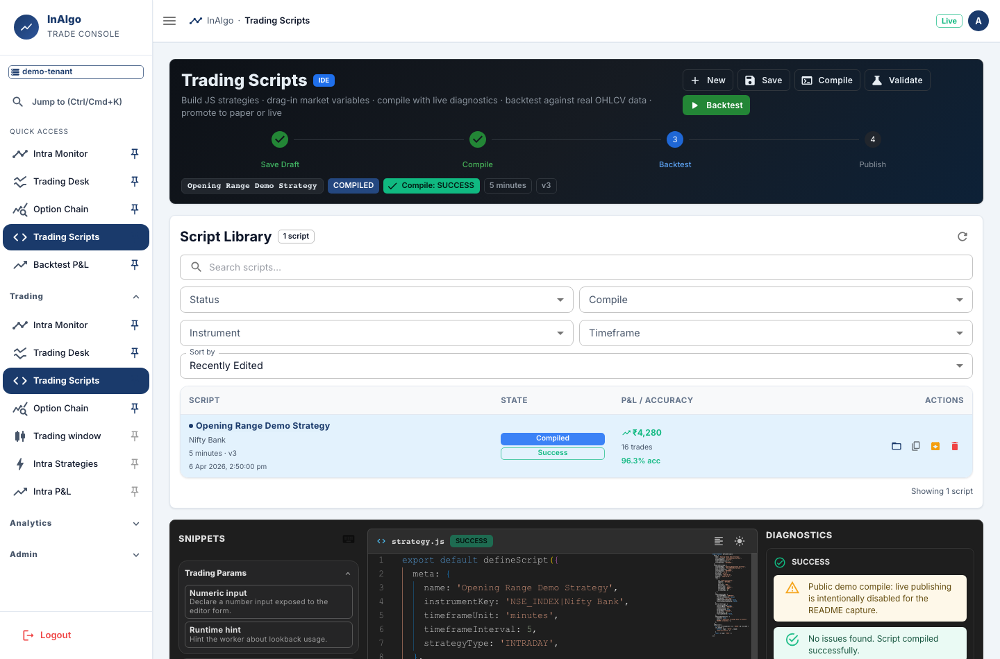
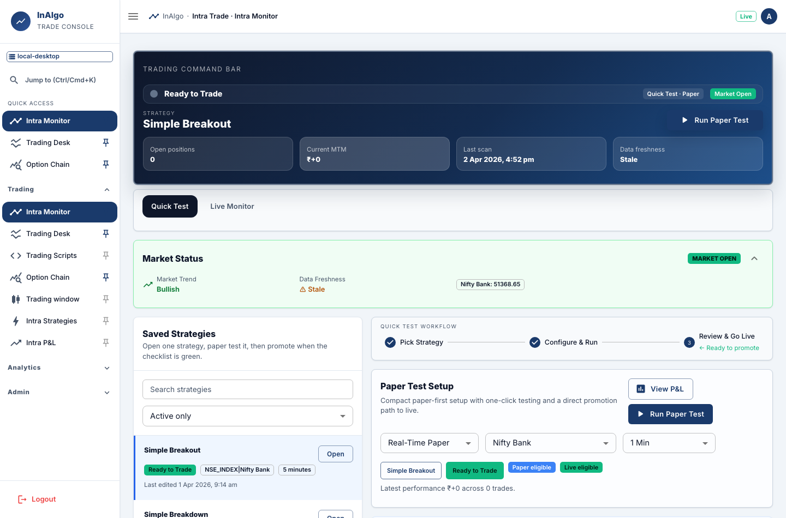
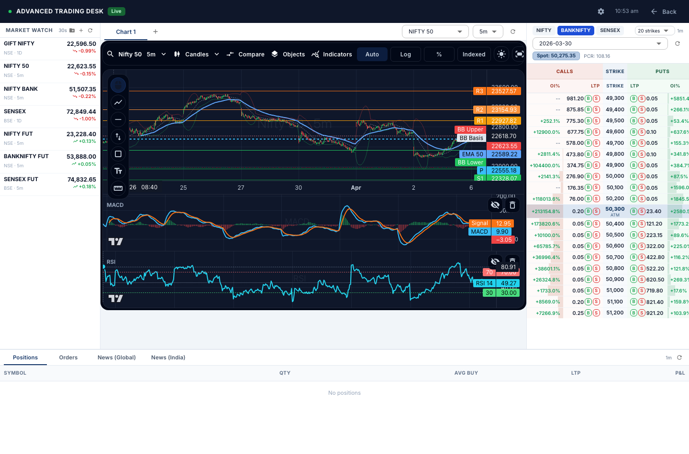
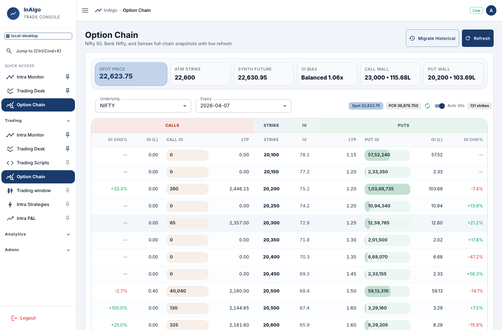
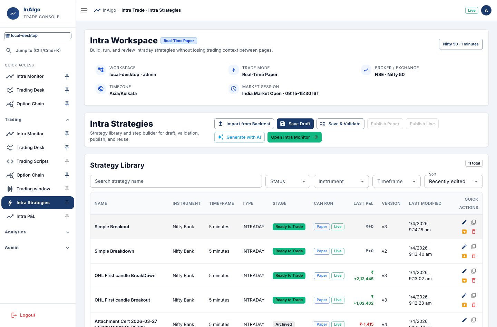
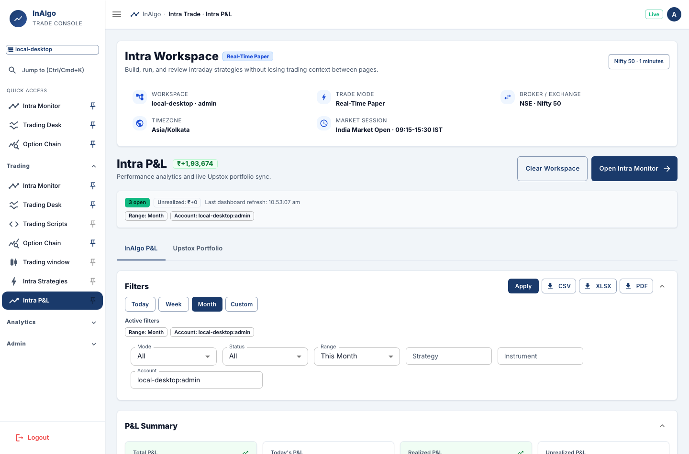
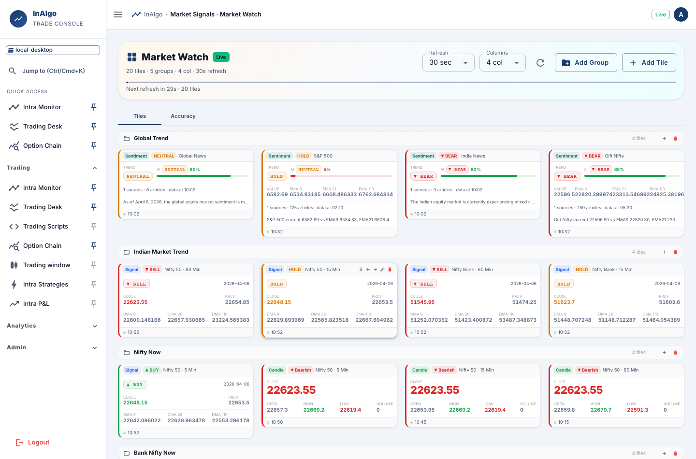
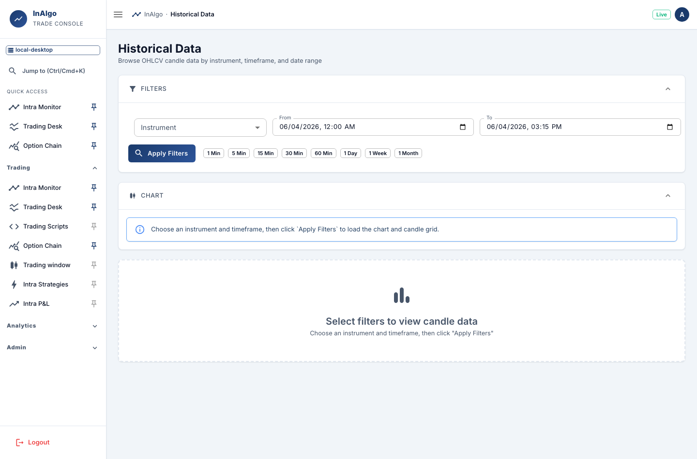
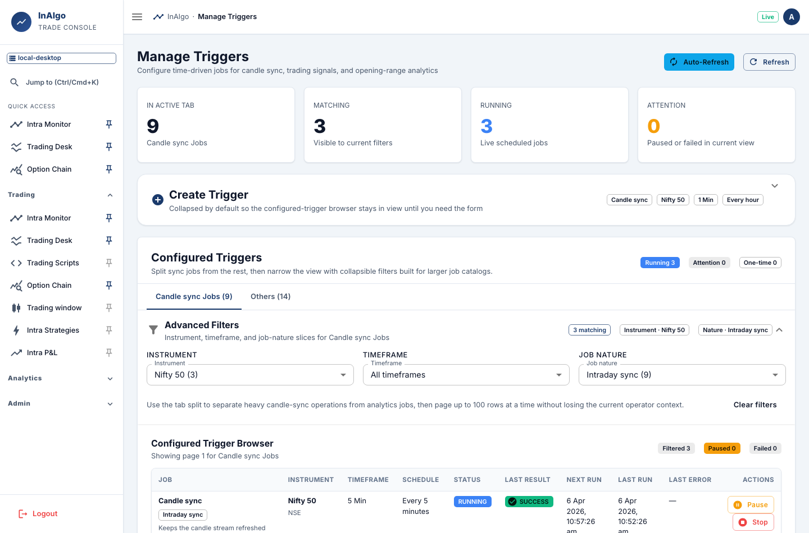

# InAlgo — Open-source intraday trading platform for Indian markets

InAlgo helps Indian-market traders and builders create, test, monitor, and improve intraday strategies with a transparent Spring Boot, PostgreSQL, React, and Playwright stack.



## Product Preview

| Strategy IDE | Intra Monitor |
|---|---|
|  |  |

| Advanced Trading Desk | Option Chain |
|---|---|
|  |  |

| Intra Strategies | Intra P&L |
|---|---|
|  |  |

| Market Watch | Historical Data |
|---|---|
|  |  |

| Manage Triggers |
|---|
|  |

## Why InAlgo

- **For traders:** backtest intraday F&O ideas, monitor paper/live execution workflows, and review strategy P&L from one local-first workspace.
- **For developers:** contribute to a real trading platform with typed APIs, Flyway migrations, React/MUI screens, Playwright coverage, and documented release gates.
- **For open-source contributors:** start with Trading Scripts, Backtest, Market Watch, Option Chain, or docs/issues without needing production broker credentials.
- **Safety note:** InAlgo is not financial advice. Live trading and broker integrations are risky, provider-dependent, and must be configured with private credentials outside source control.

## Public repository status

- License: MIT (`LICENSE`)
- Contributor guide: `CONTRIBUTING.md`
- Security policy: `SECURITY.md`
- Code of conduct: `CODE_OF_CONDUCT.md`
- Changelog: `CHANGELOG.md`
- Roadmap: `ROADMAP.md`
- Public release checklist: `docs/PUBLIC_RELEASE_CHECKLIST.md`
- Production-style E2E certificate: `docs/certification/production-e2e-certification-2026-04-06.md`

This project can connect to broker and AI provider APIs. Do not commit Upstox tokens, OpenAI keys, `.env.production`, account identifiers, or screenshots containing sensitive trading/account data.

> Publication blocker: do not publish this repository with its current full Git history until previously committed broker credentials are rotated/revoked and the public repository is created from a cleaned import or rewritten history.

## Implemented project setup

```text
.
├── backend/                  # Spring Boot 3 + Java 21 local API service
├── desktop/                  # React + Vite web admin frontend (desktop folder retained)
├── docker-compose.yml        # Optional local containerized setup
├── Makefile                  # Contributor command shortcuts
├── scripts/install-docker.sh # Docker installation helper (Ubuntu/Debian)
├── scripts/deploy-oracle-cloud.sh # Production deployment helper for Oracle Cloud VM
└── .codex/install.sh         # One-command fast container build + startup
```

## Backend stack (implemented)
- Java 21 + Spring Boot 3.3
- REST APIs with validation
- WebSocket STOMP endpoint (`/ws/events`) + heartbeat broadcast (`/topic/heartbeat`)
- Scheduling enabled (`@EnableScheduling`)
- PostgreSQL via `org.postgresql:postgresql`
- Flyway migrations (`backend/src/main/resources/db/migration`)
- Spring Data JPA with PostgreSQL dialect
- Tenant isolation via mandatory `X-Tenant-Id` request header
- Admin sessions default to `6` hours (`ADMIN_SESSION_MINUTES=360`)
- Trigger execution and built-in background schedulers are limited to the India market window (`Asia/Kolkata`, business days, `9:15 AM` to `3:30 PM` by default)
- Candle upsert API is idempotent on `(tenant_id, instrument_key, timeframe_unit, timeframe_interval, candle_ts)`
- Trading preferences persistence in dedicated `trading_preference` table keyed by `(tenant_id, username)`
- Migration runtime status persistence in `admin_migration_job` table keyed by stream identity + job type (`CANDLE_SYNC`, `TRADING_ANALYTICS_BACKFILL`)

## Frontend stack (updated for web)
- React + TypeScript + Vite web application
- MUI-based enterprise admin UI
- Admin login + migration controls + migration status monitor + historical data grid
- Migration runtime cards now include both candle sync jobs and trading analytics backfill jobs (Trading Signal + Trading Param historical population)
- Dedicated `Option Chain` screen (NIFTY/BANKNIFTY/SENSEX) with expiry selector, CE/PE table, OI bars, and auto-refresh
- Migration job control is manual per stream (start/pause/resume/stop one-by-one)
- `Manage Triggers` now includes a tabbed configured-trigger browser with collapsible advanced filters for instrument, timeframe, and job nature so admins can work through larger trigger catalogs quickly, and the create-trigger form now starts collapsed to keep the browser visible by default
- The desktop left navigation now uses a trader-first grouped IA (`Quick Access`, `Trading`, `Analytics`, `Admin`) with single-expand behavior, pin-to-quick-access shortcuts, `Ctrl/Cmd+K` command palette jump, and the existing collapsible icon rail for narrow layouts
- New `Trading Scripts` workspace with:
  - tenant-scoped library grid for save/load/duplicate/archive/delete/version history
  - Monaco-based JavaScript editor with drag-in trading snippets and inline diagnostics
  - compile, validate, backtest, paper publish, and live publish controls
  - worker-backed script compilation with platform import allowlisting and forbidden API checks
- `Market Watch` under `Market Signals` provides a configurable real-time tile board for `Trading Signal`, `Trading Param`, `Market Sentiment`, and `Candles`, with chosen-column emphasis, movable tiles, backend-persisted layout, and per-user refresh cadence
- `Trading window` feature with:
  - Up to 5 tabs
  - 2 to 10 charts per tab (add/delete enforced)
  - Resizable chart tiles
  - shared advanced `lightweight-charts` workspace used across `Trading window` and `Historical Data`
  - chart styles: candles, bars, area, line, and baseline
  - compare overlays, snapshots, fullscreen mode, price-scale presets (auto/log/percent/indexed), and theme toggle
  - drawing toolbar with trend line, horizontal line, vertical line, zone, text note, and measure tools plus an object list
  - volume + SMA/EMA/VWAP/Bollinger/Pivot/MACD/RSI overlays and panes
  - Instrument/timeframe selectors with custom instrument support
  - Per-user layout persistence (load + autosave + manual save)
- `Backtest` feature with:
  - Strategy builder UI (legs, strategy type, entry/exit time, date range)
  - Current MVP presets the underlying to `Futures`, limits strategy types to `Intraday` and `Positional`, and defaults the date range to the current month's first day through today
  - Strategy-level stop-loss/target early exit handling during run simulation
  - Strategy-level trailing stop-loss (enable + value) is supported in `Backtest P&L`, persisted with strategies, and enforced during run simulation
  - `Advance conditions` editor between `Backtest` and `Leg Builder` supports nested entry/exit condition groups using `Trading Param` and `Trading Signal` fields (including `First Candle Clr`) joined by date, instrument, and timeframe
  - Per-leg entry/exit filters configured in `Leg Builder` are enforced during backtest and intraday execution so each leg can be independently skipped or closed from live analytics conditions
  - `Strategy Logic Preview` under `Leg Builder` renders the current advanced-condition query in plain language so users can confirm exactly what the backtest will evaluate
  - Dedicated `Trading Param`, `Trading Signal`, and `Market Trend` sub-sections with paginated data grids backed by `trading_day_param`, `trading_signal`, and `market_sentiment_snapshot`
  - `Market Trend` combines news-driven Global/India posture with technical Gift Nifty and S&P 500 EMA trend signals, stores reasons, and refreshes automatically every 5 minutes
  - `Trading Param`, `Trading Signal`, and `Market Trend` grids support operational filters for faster diagnostics; `Trading Signal` grid now shows a `First Candle Clr` column (GREEN/RED) indicating the first candle direction of the trading day for that instrument and timeframe
  - Save/edit/delete strategy templates per tenant/user
  - P&L backtest run table with per-day and per-leg outputs
  - Net `Total` P&L computed as earnings minus losses
  - Real-world pricing accuracy indicator (market-priced vs fallback-priced runs)
  - Current-day backtests merge historical candles with Upstox intraday candles for active instruments
  - Expired-instrument aware contract resolution via Upstox V2 expired APIs
  - Option-leg expiry resolution now merges expired and active option catalogs so near-current trading dates choose the correct upcoming weekly/monthly expiry instead of reusing an already-expired contract
  - Futures legs configured as `WEEKLY` now fall back to the nearest available monthly futures contract when no weekly futures contract exists
  - Positional runs now skip weekend calendar exits to the next trading day, and leg exits are capped at contract expiry to avoid post-expiry synthetic mispricing
  - Expired instrument expiry/contract cache persisted in DB for faster repeat runs
  - Route-based `Intra Trade` workspace under `Backtest` with:
    - `Intra Strategies` with a dedicated strategy library (search/filter/sort/pagination + quick actions) and a 5-step strategy builder wizard (Basic/Advanced mode, draft save, validate, publish, duplicate, archive/delete)
    - `Intra Monitor` for `Real Time Live`, `Real Time Paper`, and `Historical Backtest` execution with shared trading context
      - market summary strip (trend, index values, session status, freshness/stale indicator)
      - running runtime strategies table, active positions table, emergency action panel, and ordered event/audit log
      - live-destructive action guardrails (`CONFIRM LIVE` acknowledgement + mandatory reason capture)
    - `Intra P&L` for saved execution review, reopen, exit, delete, and result inspection
      - **header P&L badge** displaying total P&L in real-time next to the page title with green/red color coding
      - top **P&L Summary** panel (8 metric cards: Total, Today, Realized, Unrealized, Win Rate, Avg Gain, Avg Loss, Max Drawdown) with correct amber coloring for Max Drawdown (risk metric)
      - **all panels are independently collapsible** (Filters, P&L Summary, Performance Charts, Strategy Performance, Trade Ledger) — toggle via chevron in each section header
      - **filters** (Mode, Status, Date Range, Strategy, Instrument, Account) with Apply/CSV/XLSX/PDF export buttons in the section header
      - **Performance Charts**: Daily Trend bar chart + Cumulative P&L running total, both using trader-friendly DD/MM/YY date format, showing up to 14 days
      - **Strategy Performance** table with:
        - count badge on section header
        - search/filter by strategy name
        - sortable columns: Trades, Win Rate %, Total P&L (click header to toggle asc/desc)
        - win-rate mini progress bar per row
        - pagination (5 / 10 / 25 per page)
      - **Trade Ledger** table with:
        - count badge (e.g. "13") on section header
        - local search by instrument/strategy/exit reason
        - Mode and Status dropdowns for quick row filtering independent of global filters
        - pagination (10 / 25 / 50 / 100 per page)
        - horizontal scroll on narrow viewports (min-width 680px)
      - report export in `CSV`, `XLSX`, and summary `PDF`
      - **Upstox Live Portfolio** tab (second tab on the same page) with:
        - real-time positions pulled from Upstox `/v2/portfolio/short-term-positions` (Symbol, Net Qty, Avg Buy, Avg Sell, LTP, P&L)
        - real-time orders pulled from Upstox `/v2/order/retrieve-all` (Symbol / trading name, Side chip, Qty / Filled, Type, Price / Avg filled price, Status, Tag)
        - summary cards: Total P&L (Day), Open Positions, Orders Today, Filled Orders
        - **auto-refresh toggle** (30-second interval) with "Last synced: HH:MM:SS" timestamp
        - manual refresh button, error banner with retry
        - Positions and Orders sections are both independently **collapsible** with count badges
        - **Bug fix**: Upstox API JSON response fields (`instrument_token`, `trading_symbol`, `buy_price`, `sell_price`, `order_id`, `transaction_type`, `filled_quantity`, `average_price`, `status_message`, etc.) now correctly deserialize via `@JsonProperty` snake_case annotations — previously all fields were silently `null`
        - **Bug fix**: live portfolio sync now accepts both wrapped and bare-array order-book payloads from Upstox, treats `order_timestamp` as the documented user-readable string, and maps position `last_price` into LTP so live positions continue rendering when Upstox returns the current documented response format
    - shared intra workspace header showing workspace, mode, exchange, timezone, and market-session context across `/intra/strategies`, `/intra/monitor`, and `/intra/pnl`

## End-to-end local runbook (Git checkout → running services)

### 1) Clone repository and checkout branch
```bash
# clone once
git clone <your-repo-url> Trade
cd Trade

# switch to your working branch
git checkout <branch-name>
```

### 2) Install prerequisites
```bash
# Java + Maven for backend
java -version
mvn -version

# Node.js + npm for frontend
node -v
npm -v
```

### 3) Install docker package (optional, but recommended)
```bash
# Ubuntu / Debian helper provided by this repo
chmod +x scripts/install-docker.sh
./scripts/install-docker.sh

# verify installation
docker --version
docker compose version
```

From the repository root, run `make help` to list contributor shortcuts for install, local services, validation, and Docker Compose.

### 4) Start PostgreSQL
Use either Docker Compose (recommended) or your own local PostgreSQL.

```bash
# one-time local environment setup; replace change-me values first
cp .env.example .env

# starts only database service in background
docker compose up -d postgres

# validate DB container health
docker compose ps
```

### Optional fast container setup (recommended for first run)
```bash
# installs docker package if needed, enables BuildKit, pre-pulls base images,
# builds services in parallel, and starts the stack
chmod +x .codex/install.sh
./.codex/install.sh
```

### 5) Run backend server (Spring Boot)
```bash
cd backend

# Optional DB overrides (only if not using default localhost values)
# export DB_URL=jdbc:postgresql://localhost:5432/trade
# export DB_USERNAME=<local-db-user>
# export DB_PASSWORD=<local-db-password>

# optional admin session override
# export ADMIN_SESSION_MINUTES=360
#
# optional India market-hours override for triggers and built-in schedulers
# export MARKET_HOURS_ZONE_ID=Asia/Kolkata
# export MARKET_HOURS_OPEN_TIME=09:15
# export MARKET_HOURS_CLOSE_TIME=15:30

mvn spring-boot:run
```

Backend defaults to `http://localhost:8081`.

### 6) Run frontend server (Vite)
Open a second terminal:
```bash
cd Trade/desktop
npm install
npm run dev:renderer
```

Frontend defaults to `http://localhost:5173`.

### 7) Login and verify UI workflows
1. Open `http://localhost:5173`.
2. Login with tenant `local-desktop`, username `admin`, and the seeded local admin password.
3. Migration tab:
   - Use **Start** on each job card to run streams one-by-one manually.
   - Manual start/restart resumes from the last stored candle timestamp for that stream.
   - Current-day candles are refreshed via the Upstox intraday endpoint; older gaps use the historical endpoint.
   - Click **Refresh Status**.
4. Historical Data tab:
   - Enter instrument/timeframe filters.
   - `From` defaults to the current day's `9:15 AM` market open and `To` defaults to `3:15 PM` market close.
   - The screen includes a collapsible filter panel and a collapsible chart panel for the selected instrument/timeframe above the candle grid.
   - Click **Apply Filters**.
5. Option Chain tab:
   - Open **Option Chain** from the left menu.
   - Select underlying and expiry.
   - Verify live CE/PE rows and summary chips.
   - Use **Migrate Historical** for bootstrap snapshot capture across available expiries.
5. Trading window tab:
   - Open **Trading window** from the left menu.
   - Add charts and tabs (up to 5 tabs / up to 10 charts per tab).
   - Change instrument/timeframe and resize chart tiles.
   - Click **Save Layout**.
   - Refresh page and verify the same layout reloads for the same username.
6. Trading Scripts tab:
   - Open **Trading Scripts** from the left menu.
   - Load an existing script or create a new draft.
   - Insert snippets, save, compile, and review diagnostics.
   - Run **Backtest** and verify metrics populate.
   - Promote to **Paper Ready** and then **Live Ready** only after eligibility gates pass.
6. Market Watch tab:
   - Open **Market Signals -> Market Watch** from the left menu.
   - Add or edit tiles for `Trading Signal`, `Trading Param`, `Market Sentiment`, and `Candle`.
   - Change the tile `Primary column`, reorder tiles, then click **Save Layout**.
   - Confirm the screen reloads the same layout and shows live data from the latest tenant rows.

### 8) Optional all-in-one Docker startup
```bash
docker compose up --build
# PostgreSQL data persisted under docker volume: pg_data
```

### 9) Run feature tests
```bash
# backend preference service tests
cd backend
mvn -Dtest=TradingPreferenceServiceTest test

# backend market trend tests
mvn -Dtest=MarketSentimentServiceTest,BacktestAnalyticsServiceTest,UpstoxSchedulersTest test

# frontend type-check + build + e2e
cd ../desktop
npm run lint
npm run build
npm run test:e2e

# source-file token budget gate (backend + frontend sources)
cd ..
scripts/check-source-token-budget.sh
```

### 10) Contributor shortcut commands
```bash
# list available targets
make help

# validate Docker Compose configuration
make docker-config

# run the standard local validation bundle
make validate
```

`Makefile` detects either the modern `docker compose` plugin or the legacy `docker-compose` binary for local contributor commands.

## Production deployment on Oracle Cloud VM

1. Provision an Oracle Cloud Compute instance (Ubuntu/Debian), open inbound ports `80/443` (and app ports if needed), and install Git.
2. Clone this repository on the instance.
3. Create `.env.production` from the provided example and set secure credentials.
4. Run the deployment helper:

```bash
cp .env.production.example .env.production
# edit .env.production with production values

chmod +x scripts/deploy-oracle-cloud.sh
./scripts/deploy-oracle-cloud.sh --branch main --env-file .env.production
```

What the script does:
- Installs Docker package (if missing) via `scripts/install-docker.sh`.
- Pulls latest code for the selected branch.
- Validates Docker Compose configuration using your production env file.
- Builds and starts the stack with Docker Compose in detached mode.

## Key API endpoints
- `POST /api/v1/candles` (upsert candle)
- `GET /api/v1/candles` (paged query with `from/to` range)
- WebSocket endpoint: `/ws/events`
- Heartbeat topic: `/topic/heartbeat`
- `GET /api/v1/upstox/intraday` (proxy Upstox intraday candles)
- `GET /api/v1/upstox/historical` (proxy Upstox historical candles)
- `GET /api/v1/upstox/option-chain` (proxy Upstox option chain)
- `GET /api/v1/upstox/option-contracts` (proxy Upstox option contracts/expiries)
- `POST /api/v1/upstox/connectivity-test` (matrix connectivity checks by instruments/timeframes)
- `GET /api/v1/admin/historical-data` (admin paged candle query)
- `GET /api/v1/admin/option-chain/expiries` (option expiry list for underlying)
- `GET /api/v1/admin/option-chain/latest` (latest option chain snapshot rows)
- `GET /api/v1/admin/option-chain/history` (paged historical snapshot rows)
- `GET /api/v1/admin/backtest/trading-signals` (paged trading signal grid rows)
- `GET /api/v1/admin/backtest/trading-day-params` (paged trading day parameter grid rows)
- `POST /api/v1/admin/option-chain/migrate-historical` (bootstrap option-chain snapshot capture)
- `POST /api/v1/admin/migrations/{jobKey}/start` (manual per-job start/restart)
- `POST /api/v1/admin/migrations/{jobKey}/pause`
- `POST /api/v1/admin/migrations/{jobKey}/resume`
- `POST /api/v1/admin/migrations/{jobKey}/stop`
- `GET /api/v1/admin/triggers` (list configured sync triggers)
- `GET /api/v1/admin/triggers/browser` (paged trigger browser with tab and facet metadata for the admin UI)
- `POST /api/v1/admin/triggers` (create a new time-driven trigger)
- `POST /api/v1/admin/triggers/{triggerId}/start`
- `POST /api/v1/admin/triggers/{triggerId}/pause`
- `POST /api/v1/admin/triggers/{triggerId}/resume`
- `POST /api/v1/admin/triggers/{triggerId}/stop`
- `POST /api/v1/admin/trading/day-params/refresh` (manual backfill/refresh for `trading_day_param` over a requested date range)
- `GET /api/v1/admin/trading/preferences?username=<username>` (load user trading layout)
- `PUT /api/v1/admin/trading/preferences` (save user trading layout payload)
- `GET /api/v1/admin/backtest/strategies?username=<username>&page=<n>&size=<n>` (list saved backtest strategies)
- `POST /api/v1/admin/backtest/strategies` (create strategy)
- `PUT /api/v1/admin/backtest/strategies/{strategyId}` (update strategy)
- `DELETE /api/v1/admin/backtest/strategies/{strategyId}?username=<username>` (delete strategy)
- `POST /api/v1/admin/backtest/run` (run backtest and return P&L rows)
- `POST /api/v1/admin/intra-strategies/ai-generate` (generate 2-3 AI-assisted intraday strategy candidates from `trading_signal` + `trading_day_param`, backtest each candidate, and return a trend-aligned recommendation)

> All REST calls require `X-Tenant-Id`.

## Upstox configuration
- Upstox token is tenant-scoped and stored in DB via Admin UI (`Migration Jobs` section).
- Upstox and OpenAI tokens are secrets; configure them outside source control and rotate any token that may have been exposed in local artifacts before publishing the repository.
- Trigger scheduler poll interval:
  - `ADMIN_TRIGGER_POLL_MS`
- `UPSTOX_BASE_URL` can be set for sandbox environments.
- Option-chain scheduler config keys:
  - `UPSTOX_OPTION_CHAIN_ENABLED`
  - `UPSTOX_OPTION_CHAIN_TENANT_ID`
  - `UPSTOX_OPTION_CHAIN_REFRESH_SECONDS`
  - `UPSTOX_OPTION_CHAIN_MAX_EXPIRIES`

## Default migration catalog instruments
- Spot indices:
  - `NSE_INDEX|Nifty 50`
  - `NSE_INDEX|Nifty Bank`
  - `BSE_INDEX|SENSEX`
- Current monthly futures (added to migration jobs with same timeframes):
  - `NSE_FO|51714` (`NIFTY FUT 30 MAR 26`)
  - `NSE_FO|51701` (`BANKNIFTY FUT 30 MAR 26`)
  - `BSE_FO|825565` (`SENSEX FUT 25 MAR 26`)

Note: futures instrument keys are contract-specific and must be rolled forward on expiry.

## Feature documentation
- Feature catalog: `docs/features/README.md`
- Manage triggers feature: `docs/features/manage-triggers/feature.md`
- Manage triggers test cases: `docs/features/manage-triggers/test-cases.md`
- Trading window feature: `docs/features/trading-window/feature.md`
- Trading desk feature: `docs/features/trading-desk/feature.md`
- Trading desk test cases: `docs/features/trading-desk/test-cases.md`
- Market Trend feature: `docs/features/market-trend/feature.md`
- Market Trend test cases: `docs/features/market-trend/test-cases.md`
- Market Watch feature: `docs/features/market-watch/feature.md`
- Market Watch test cases: `docs/features/market-watch/test-cases.md`
- Trading Scripts feature: `docs/features/trading-scripts/feature.md`
- Trading Scripts test cases: `docs/features/trading-scripts/test-cases.md`
- Intra Trade feature: `docs/features/intra-trade/feature.md`
- Intra Trade test cases: `docs/features/intra-trade/test-cases.md`
- Option chain feature: `docs/features/option-chain/feature.md`
- Option chain test cases: `docs/features/option-chain/test-cases.md`

## Structured change notes
- Manage Triggers browser and filters: `docs/changes/manage-triggers-browser-and-filters.md`
- Public release readiness: `docs/changes/public-release-readiness-2026-04-06.md`

## Engineering standards
- AI collaboration rules: `AGENTS.md`
- Architecture and PR readiness rules: `docs/AI_AGENT_DEVELOPMENT.md`
- Enterprise delivery standard and default skill policy: `docs/ENTERPRISE_DELIVERY_STANDARD.md`
- Enterprise coding, API, security, scalability, performance, and code-quality standard: `docs/ENTERPRISE_CODING_STANDARD.md`
- Detailed stack and environment conventions: `CLAUDE.md`
- Public contribution guide: `CONTRIBUTING.md`
- Security reporting and secret-handling policy: `SECURITY.md`

## Multi-AI agent collaboration rules
- Architecture and delivery workflow rules for AI + human contributors live in `docs/AI_AGENT_DEVELOPMENT.md`.
- Enterprise delivery defaults, release gates, and artifact expectations live in `docs/ENTERPRISE_DELIVERY_STANDARD.md`.
- Coding and architecture standards for implementation work live in `docs/ENTERPRISE_CODING_STANDARD.md`.
- Follow the PR readiness checklist in that document so every feature is tracked, tested, and verified before merge.
- Keep controller/service/repository responsibilities separated to preserve safe parallel development by multiple agents.
